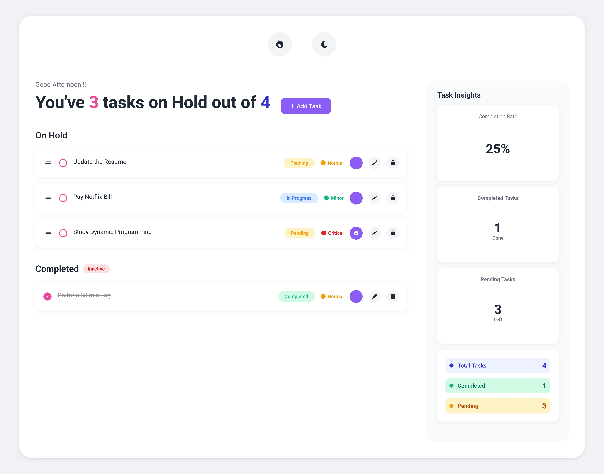

# Advance Todo App 🧠

A clean, focused task manager built with vanilla HTML, CSS, and JavaScript. It helps you keep a short, intentional task list with priority labels, completion stats, drag-and-drop ordering, focused work mode, and light/dark theme support.



## ✨ Features

- 📝 Add, edit, complete, and delete tasks
- 🔥 Mark important tasks as **Focused Work**
- 🎯 Toggle focused mode to show only focused on-hold tasks
- 📊 Track completion rate, completed tasks, pending tasks, and total tasks
- 🏷️ Use status labels: Pending, In Progress, and Completed
- 🚦 Use priority labels: Minor, Normal, and Critical
- 🌗 Switch between light and dark themes
- 💾 Save tasks, theme, and focus mode in `localStorage`
- ↕️ Reorder on-hold tasks with drag and drop

## 🛠️ Tech Stack

- HTML5
- CSS3
- JavaScript ES Modules
- Font Awesome icons
- Browser `localStorage`

## 🌍 Live At :: [Advance To Do](https://advance-todo.alavyapandey.com/)

## 🚀 Run Locally

Clone or download the project, then open it with a local server:

```bash
python3 -m http.server 5173
            or
use any extension for live server
```

Then visit:

```text
http://127.0.0.1:5173/index.html
```

> A local server is recommended because the app uses JavaScript modules.

## 📁 Project Structure

```text
.
├── assets/
│   └── advance-todo-preview.png
├── index.html
├── styles.css
├── script.js
├── modules/
│   ├── constants.js
│   ├── dragDrop.js
│   ├── focusedMode.js
│   ├── limits.js
│   ├── modal.js
│   ├── state.js
│   ├── storage.js
│   ├── taskManager.js
│   ├── theme.js
│   └── ui.js
├── LICENSE
└── README.md
```

## 🧩 How It Works

The app is split into small modules:

- `state.js` manages shared task and UI state
- `storage.js` persists tasks and preferences
- `taskManager.js` handles task CRUD actions
- `ui.js` renders task lists and dashboard stats
- `focusedMode.js` controls the focused-work filter
- `dragDrop.js` handles task reordering
- `theme.js` applies light/dark theme behavior

## 💡 Why Advance Todo?

Advance Todo is designed for a simple workflow: keep only what matters visible, finish work intentionally, and quickly understand your progress at a glance.

## 📄 License

This project is licensed under the terms in the [LICENSE](LICENSE) file.
